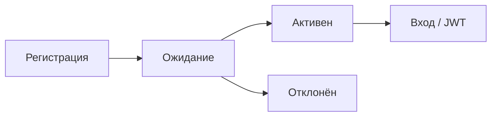

# HubDesk — Возможности программы

## Аутентификация и роли



- **JWT-токены** — HS256, bcrypt для паролей
- **Remember-me** — 7 дней против 4 часов
- **Pending-пользователи не могут войти** без утверждения админом
- **Нельзя самоназначить admin** при регистрации

### 9 ролей:

| Роль | Видит заявки | Создаёт | Меняет статус | Назначает | Склад | Админка | Отчёты |
|---|---|---|---|---|---|---|---|
| **admin** | Все | Да | Вперёд по FSM | Да | Да | Да | Да |
| **director** | Все | Да | Вперёд по FSM | Да | Да | Нет | Да |
| **dispatcher** | Все | Да | Завершение по FSM | Да | Нет | Нет | Да |
| **accountant** | Все | Да | Вперёд по FSM | Да | Просмотр | Нет | Да |
| **engineer** | Назначенные | На себя | Назначенные по FSM | Нет | Просмотр доступных | Нет | Нет |
| **storekeeper** | Нет | Нет | Нет | Нет | Да | Нет | Нет |
| **metrologist** | Нет | Нет | Нет | Нет | Вставки | Нет | Нет |
| **customer** | Своего клиента | Да | Нет | Нет | Нет | Нет | Нет |
| **viewer** | Все | Нет | Нет | Нет | Нет | Нет | Нет |

---

## Заявки (Ticket)

### Жизненный цикл (FSM)

```
ASSIGNED → ACCEPTED → IN_PROGRESS → COMPLETED
```
- Все переходы — только вперёд
- При `COMPLETED` заявка автоматически уходит в архив
- Чек-листы обязательны при `IN_PROGRESS → COMPLETED`

### 15 полей заявки:
Тема, описание, тип (ремонт/монтаж/ТО/инспекция/авария), приоритет (низкий/средний/высокий/критический), объект, оборудование, клиент, исполнитель, группа, контакты на объекте (ФИО + телефон), плановый выезд с/по, срок исполнения, источник обращения, внутренняя/внешняя

### Таблица заявок:
- Три режима: таблица / карточки / дерево
- Перетаскивание и ресайз колонок
- Фильтр по клику на статус/приоритет/дату/срок
- Вкладки: Все / Назначены / В работе / Просрочены / Архив
- Поиск по номеру и теме
- Назначение инженера прямо в таблице
- Редактирование всех полей через кнопку ✎

---

## Календарь

- Месячная сетка
- Заявки по дате исполнения, только открытые
- Цветовые индикаторы приоритета
- Сегодняшний день обведён
- Клик по дню — модалка со списком заявок

---

## Объекты и оборудование

- CRUD объектов с адресами, контактами, закреплённым инженером, договором
- Оборудование: серийный номер, модель, QR-код, история обслуживания

---

## Склад и инвентаризация

**FSM документов:** `DRAFT → APPROVAL → DELIVERY → ACCOUNTED`

- Три типа: приход, перемещение, списание
- Остатки меняются только при учтённом документе
- Номенклатура: материалы, товары, услуги, работы
- Физические и персональные склады
- Контроль доступа к складам (admin + storekeeper)

---

## Отчёты

Доступ: admin, dispatcher. Фильтр по диапазону дат.

- **Заявки** — KPI (всего, ср. время, SLA %), раскладка по статусам/приоритетам/типам
- **Объекты** — всего/открыто/закрыто/просрочено/ср. время по каждому объекту
- **Инженеры** — назначено/выполнено/в работе/просрочено/ср. время

---

## Почта (Email-интеграция)

- IMAP (imap.example.com:993)
- Автосбор писем → создание заявок (тема, текст, отправитель)
- Фоновый worker каждые 2 минуты
- Ручная проверка
- SMTP (smtp.example.com:465) зарезервирован для будущих уведомлений

---

## Администратор

6 вкладок:

| Вкладка | Функции |
|---|---|
| Дашборд | KPI системы: пользователи, клиенты, склады, заявки |
| Пользователи | Редактирование, смена роли и пароля, удаление |
| Модерация | Утверждение/отклон pending-пользователей |
| Клиенты | CRUD клиентов |
| История | Просмотр history.log |
| Почта | Настройка IMAP, ручная проверка |

---

## Чек-листы

- Создание чек-листов на заявку
- Поля: текст / число / галочка / фото / подпись
- Обязательные поля блокируют завершение заявки

---

## Комментарии

- Публичные и внутренние
- Внутренние не видны customer и engineer
- Прикреплённые файлы (upload в `uploads/`)

---

## Сохранённые виды

- Сохранение настроек фильтра, сортировки, колонок
- Переключение через выпадающий список

---

## Технический стек

| Слой | Технология |
|---|---|
| Бэкенд | FastAPI + async SQLAlchemy |
| База данных | PostgreSQL (asyncpg) |
| Кэш | Redis (настроен) |
| Аутентификация | JWT (HS256) + bcrypt |
| Фронтенд | React 18 + TypeScript + Vite |
| Стейт | Zustand |
| HTTP | Axios (авто-выход при 401) |
| Drag & Drop | @dnd-kit |
| Почта | imaplib (stdlib) |
| Файлы | Локальная файловая система |
| Логирование | history.log (текстовый журнал) |

---

## Бизнес-правила

1. Статус меняется только через FSM
2. Инвентаризация — только через учётные документы
3. Инженер видит только свои заявки, заказчик — только своего клиента
4. Чек-лист с обязательными полями — блок завершения
5. Внутренние комментарии скрыты от заказчиков и инженеров
6. SLA-сроки рассчитываются из активного договора при создании заявки
7. Все саморегистрации требуют утверждения админом
8. Нельзя удалить самого себя
9. Клиент с объектами не удаляется

---

## Тестовые данные (seed)

- 8 пользователей всех ролей
- 4 клиента
- 8 объектов с договорами
- 6 складов
- 14 позиций номенклатуры
- 15 заявок во всех статусах
- 1 учтённый документ (приход)
- 10 записей остатков
